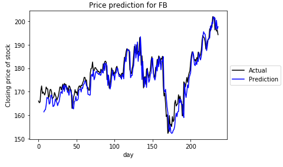

# Stock Prediction System

# Project Goal
The goal for this project is to demonstrate one approach to building a stock prediction system using [Recurrent Neural Networks (RNN)](https://en.wikipedia.org/wiki/Recurrent_neural_network) that 1) make accurate predictions and 2) can serve as a basis for creating a more robust stock prediction system.  

The project is divided in four sections (the project’s pipeline):
>    1. Prepare data – we download closing prices (from yahoo finance) for a list of stocks and prepare it for Neural Network (NN) input.
>    2. Model selection – Test out a few different RNN models with various different hyper-parameters to determine which model performs better.  
>    3. Model training – Based on the model selection process we train a model for each stock in our population. 
>   4. Making predictions – make predictions for new stocks using the trained models.   

Each section is described in a jupyter notebook.

# What is predicted?
The projection system demonstrated here predicts the following day's closing for a specific stock.  By using an RNN model and providing the previous day’s closing prices as input, we can predict the following day’s closing price for a given stock. 

# Stock prediction premise.
The premise of the stock prediction system is that we want to model paths for a sample of stocks, and then train an RNN model for each path.  We can then make predictions for a new stock by passing the historical closing prices of this stock to each trained model (trained path) and select the model (path) with the lowest median squared error (MSE) to make predictions.

# Conclusion
As evident in the `prediction.ipynb` jupyter notebook, our stock projections made very accurate predictions when introduced with a new stock.   For example, when we tried to predict the closing price for Facebook we obtained the following results:

 

Although, our system produced accurate results, it only produces a prediction one day in the future. 

These are two ways to improve this projection system:
>    1.	Predict more days in the future such as up to 10 or 15 days.  This can be accomplished by converting our RNN training model to a sequence-to-sequence model from the current sequence-to-prediction model.
>    2.	 Add more features to the input sequence.  In the `model_selection.ipyjnb` notebook it became evident that using three features produced better results than one feature.  There are many more features than can be explored as possible inputs.

Overall, this project achieved its goals of developing a stock prediction system that makes accurate predictions and provides a basis for creating an expansive trading system.     
